# Skinstinct LinkedIn Drafting Assistant

An assistant for Meera Pillai (founder, Skinstinct) that turns raw notes dropped
into a Telegram channel into LinkedIn-ready drafts, in her voice, scored and
decided against her own bar before she ever sees them.

## What it does

Posting a note into the Telegram channel runs it through five sequential
stages, each its own Telegram message (or an edit of the previous one), so
Meera sees the draft itself before anything is judged:

1. **Note received.** Any message that isn't a command and isn't too short
   (`MIN_NOTE_CHARS`, default 40) starts the pipeline the moment it's posted -
   no `/draft` needed. Processed one at a time via an internal queue, so
   several notes posted quickly never trigger parallel Gemini calls.
2. **Draft.** A LinkedIn post is drafted in Meera's voice, using
   `skills/SKILL.md` as the full system instruction - it also classifies its
   own category (A-G) and thesis. No research or news at this stage.
3. **Evaluate.** Only once the draft message above is confirmed sent: the raw
   note is triaged (a quality score, for the backlog and `/week`), and an
   independent editor pass scores the draft on five dimensions - Facts,
   Voice, Structure, Hook, Reader.
4. **Decide.** A binary verdict, per the rule below - ✅ Approved or
   ❌ Rejected, with the reasons.
5. **News (approved only).** A real, related news item is looked up via
   Google News RSS and attached - never invented, never written into the
   post text itself.

Everything is also shown in a web dashboard, with a stage timeline and a
related-news card, for a fuller review.

## The decision rule

Binary, no middle ground:

```
APPROVED  if  final_score >= AUTO_APPROVE_THRESHOLD  and  no hard blocks
REJECTED  otherwise
```

`final_score` is the weighted sum of the five editor dimensions (equal 20%
weights by default, configurable), scaled to 0-100. `AUTO_APPROVE_THRESHOLD`
defaults to 85 (`/threshold <n>`, 50-100).

**Hard blocks** override the score - any one of these forces REJECTED,
because they need Meera's input, not a better draft:
- any unresolved `[VERIFY: ...]` tag
- a deterministic checklist failure (word count outside 450-650, banned
  formatting - emoji/hashtag/bullet/bold/header/exclamation/audience question,
  em dashes instead of spaced hyphens)
- an unsupported claim the editor found (stated as fact but not in the
  canonical fact sheet, the note, or `[VERIFY]`-tagged)
- the draft names a competitor
- the draft claims medical/dermatological authority
- the editor's Facts score is below the fact-integrity floor (7/10)

News is not part of the decision at all - it's only looked up *after* a
draft is already approved, so there's no "missing source" block.

`/autoapprove on|off` controls whether an APPROVED verdict is *applied*
automatically:
- **on** (default): APPROVED drafts are marked approved immediately - ready
  to copy, no button needed (news attaches automatically). REJECTED drafts
  get ✏️ Redraft / 🗑 Discard.
- **off**: the verdict is still computed and shown in full, but every draft
  always gets a manual [✅ Approve] [🗑 Discard] pair - nothing auto-applies,
  and news only fetches once she actually presses Approve.

A weekly cap (`weekly_cap`, default 3) is tracked for `/week` but does not
gate the decision.

## The one hard rule

**This app never posts to LinkedIn.** There is no LinkedIn API integration
anywhere in this codebase, no auto-publishing, no scheduling to LinkedIn.
"Approved" means the draft is ready in the dashboard for Meera to copy and post
herself, in her own account, on her own schedule. This is a deliberate design
choice, not a missing feature - she rejected end-to-end tools specifically
because she wants control over what goes out under her name.

The same discipline applies to the approved text itself: once a draft is
evaluated, its body is hashed. Every "Copy" action re-checks that hash first,
so the text Meera copies is always exactly what was scored - news is attached
to the draft record as a citation, never written into the post body.

## Pipeline

```mermaid
flowchart LR
    subgraph Stage1["Stage 1: Input"]
        TG["Telegram channel\nany message, not a command,\nnot too short"]
        Queue["asyncio queue\none note at a time"]
    end
    subgraph Stage2["Stage 2: Draft"]
        Draft["AI call #1: Draft\nSKILL.md as system instruction -\nself-classifies category + thesis"]
    end
    subgraph Stage3["Stage 3: Evaluate"]
        Triage["AI call #2: Triage\nnote quality score"]
        Editor["AI call #3: Editor\nFacts / Voice / Structure / Hook / Reader,\nissues, unsupported claims"]
    end
    subgraph Stage4["Stage 4: Decide"]
        Decide["final_score >= threshold\nAND no hard blocks?"]
    end
    subgraph Stage5["Stage 5: News (approved only)"]
        Queries["AI call #4a: build 3 search queries"]
        RSS["Google News RSS\n(cached 6h)"]
        Rank["AI call #4b: rank by number only -\nnever invents a title or URL"]
    end
    subgraph Output
        Bot["Telegram: one message per stage,\nedited through progress"]
        Dash["Dashboard\nInbox / Draft Studio / This Week / Backlog"]
    end

    TG --> Queue --> Draft
    Draft --> Triage
    Draft --> Editor
    Triage --> Decide
    Editor --> Decide
    Decide -- REJECTED --> Bot
    Decide -- APPROVED --> Queries --> RSS --> Rank --> Bot
    Bot --> Dash
```



A weekly job (APScheduler, Monday 09:00 IST) ranks the backlog and drafts the
top 3 automatically. A "Draft next best note" button in the dashboard and a
`/draft` bot command do the same thing on demand, through the same 5-stage
flow, for one note at a time - but neither is required day-to-day now that
posting a note evaluates it instantly. A daily nudge (19:00 IST, once a day at
most) reminds Meera if drafts are waiting for review.

## Module layout

```
app/
  bot/
    telegram_bot.py   long polling, command registration, scheduler startup
    handlers.py        the 5-stage pipeline runner, note intake, buttons
    commands.py         /start /status /draft /backlog /autoapprove /threshold
                         /settings /scores /week /calibration
    formatting.py        HTML message building per stage (escaping, verdict,
                          scores, news list, the 4096-char split)
    queue_worker.py       single-consumer asyncio queue for note evaluation
  pipeline/
    draft.py       AI call #1 - drafts and self-classifies (no research)
    triage.py        AI call #2 - note quality score, for the backlog
    editor.py          AI call #3 - five-dimension scoring
    decision.py           binary verdict + hard blocks
    news.py                  AI calls #4a/#4b + Google News RSS (approved only)
    checklist.py, gemini_client.py, week.py,
    orchestrator.py (ties every stage together, shared by bot/api/scheduler)
  db/
    models.py            Note, Draft, DraftNews, NewsQueryCache, AppSettings,
                          DecisionLog
    settings_store.py     runtime-mutable settings (mode, threshold, weights)
    migrations.py          one-off data migrations, run on every startup
    session.py
  api/         FastAPI routes for the dashboard
  scheduler.py Weekly draft job + daily nudge job (APScheduler)
  cli.py       Bulk-import a folder of .txt/.md notes
  main.py      FastAPI app; serves the built dashboard in production
web/           React + Vite + TypeScript + Tailwind dashboard
skills/        SKILL.md - Meera's voice/style guide, loaded verbatim
samples/       5 fake example notes for a no-real-data demo
tests/         pytest - see Tests below
```

## Setup

### 1. Telegram bot

1. Talk to [@BotFather](https://t.me/BotFather), `/newbot`, get a bot token.
2. Create (or use an existing) Telegram **channel** for Meera's notes.
3. Add the bot to the channel **as an admin** (channels only deliver
   `channel_post` updates to bots that are admins - a regular member won't work).
4. Get the channel's chat ID (starts with `-100...`) - forward a message from
   the channel to [@userinfobot](https://t.me/userinfobot), or check the
   `channel_post.chat.id` field in `getUpdates` after step 3.

### 2. Gemini API

Get an API key from [Google AI Studio](https://aistudio.google.com/). The
default model (`gemini-3.8-flash`) is used for every AI call in the pipeline;
override `GEMINI_MODEL` in `.env` if Google ships a newer recommended model
later.

### 3. Environment

```bash
cp .env.example .env
```

Fill in `TELEGRAM_BOT_TOKEN`, `TELEGRAM_CHAT_ID`, `GEMINI_API_KEY`. `.env` is
git-ignored - it is never committed. Everything else (`MIN_NOTE_CHARS`,
`ADMIN_USER_IDS`, `NEWS_*`) can be left at its default to start.

### 4. Install

```bash
make install
```

This creates a Python virtualenv (`.venv`), installs backend dependencies
(including `httpx` and `feedparser` for the news module), and runs
`npm install` for the dashboard. Requires Python 3.11+ and Node 18+.

### 5. Run

```bash
make dev    # FastAPI (port 8000, with reload) + Vite dev server (port 5173)
make bot    # Telegram bot, long polling - run this in a second terminal
```

Open the dashboard at `http://localhost:5173` during development (it proxies
`/api` to the FastAPI server). In production, `make build` builds the
dashboard to `web/dist/`, and `app.main` serves it directly from the same
FastAPI process on port 8000 - only `make bot` needs to run alongside it.

### 6. Try it without real data

```bash
.venv/bin/python -m app.cli import-notes --folder samples
```

Imports the 5 fake notes in `samples/`. Then just post one of them (or your
own note) into the Telegram channel - no command needed, it evaluates on
arrival. Or use "Draft next best note" in the dashboard, or `/draft` in
Telegram, to draft straight from the backlog.

### 7. Meera's backlog (~60 notes)

Drop her existing notes as `.txt` or `.md` files into `notes/` (git-ignored)
and run `make import-notes`, or drag them onto the Backlog page in the
dashboard. Imported notes sit in the backlog until triaged via `/backlog`,
`/draft`, or the weekly job - only messages posted live into the channel
trigger instant evaluation.

## Bot commands

- `/start` - what the bot does, and the "drafts only" principle
- `/status` - note counts by status
- `/draft` - draft the single best note in the backlog right now (optional -
  live notes evaluate instantly without it)
- `/backlog` - top 5 unused notes with scores
- `/autoapprove [on|off]` - show or set the mode
- `/threshold [n]` - show or set the auto-approve score threshold (50-100)
- `/settings` - mode, threshold, weekly usage, weights, nudge config
- `/scores <draft_id>` - full score breakdown, formula, block reasons, issues,
  and any related news
- `/week` - this week's approvals (auto vs manual), pending review count
- `/calibration` - across the last 30 decided drafts: how often Meera agreed
  with the auto verdict, the undo rate, and a suggested threshold (needs at
  least 15 decided drafts)

`/autoapprove` and `/threshold` require the sender's Telegram user ID to be in
`ADMIN_USER_IDS` when that's set; empty (the default) trusts anyone in the
configured channel, same as every other command and button.

## Related news (Google News RSS)

Runs only after a draft is approved, never before and never as part of the
decision:

1. One Gemini call turns the approved post into 3 short search queries, each
   with `when:{NEWS_LOOKBACK_DAYS}d` appended.
2. All 3 queries are fetched in parallel from Google News RSS
   (`news.google.com/rss/search`, India English edition), deduplicated by
   normalised title, and cached per query for 6 hours (SQLite) so a redraft or
   "Other news" doesn't refetch.
3. A second Gemini call ranks the real candidates by **number only** - it can
   never invent a title or URL, and any out-of-range number it returns is
   dropped.
4. Items below `NEWS_MIN_RELEVANCE` (default 6) are discarded; the top
   `NEWS_MAX_ITEMS` (default 3) are kept.
5. Each link (a Google News redirect URL) is resolved to the publisher's real
   URL where possible, falling back to the Google News link if that fails.
6. Only the headline, publisher, date and link are stored - never article
   text - per copyright.

A lookup failure never breaks the pipeline; it just means no news gets
attached. `NEWS_ENABLED=false` turns the whole stage off.

## Tests

```bash
make test
```

Covers: the binary decision engine (threshold edges, each hard block, mode=on
vs off); the 5-stage pipeline order (evaluation never starts before the draft
message is confirmed sent; a rejected draft never triggers the news fetch);
the Google News module (RSS parsing from a fixture, deduplication, the
`when:Nd` query suffix, the ranker rejecting out-of-list picks, redirect-
resolution fallback, the cache being hit on repeat/"Other news" fetches, and a
news failure not breaking the pipeline); the body-hash integrity check; triage
JSON parsing and retry-on-failure; the deterministic checklist validator;
message building (HTML escaping, `[VERIFY]` bolding, the 4096-char split,
keyboards per state); the note-evaluation trigger (short messages and
commands are ignored, valid notes are queued); the queue worker (jobs run one
at a time, a failure doesn't stop it); the redraft flow; the data migration
from the old 3-band decision model; and the Telegram chat-ID filter.

## Fact integrity

The model never invents Skinstinct data or study citations. Anything it can't
verify against `skills/SKILL.md`'s canonical fact sheet or the note itself is
marked `[VERIFY: ...]` in the draft body - and any such tag is an automatic
hard block, so a draft with unresolved facts can never be auto-approved. The
same rule extends to news: only real RSS results, picked by number, are ever
attached - the ranking model cannot introduce a title or URL of its own. The
dashboard highlights every `[VERIFY]` occurrence.
